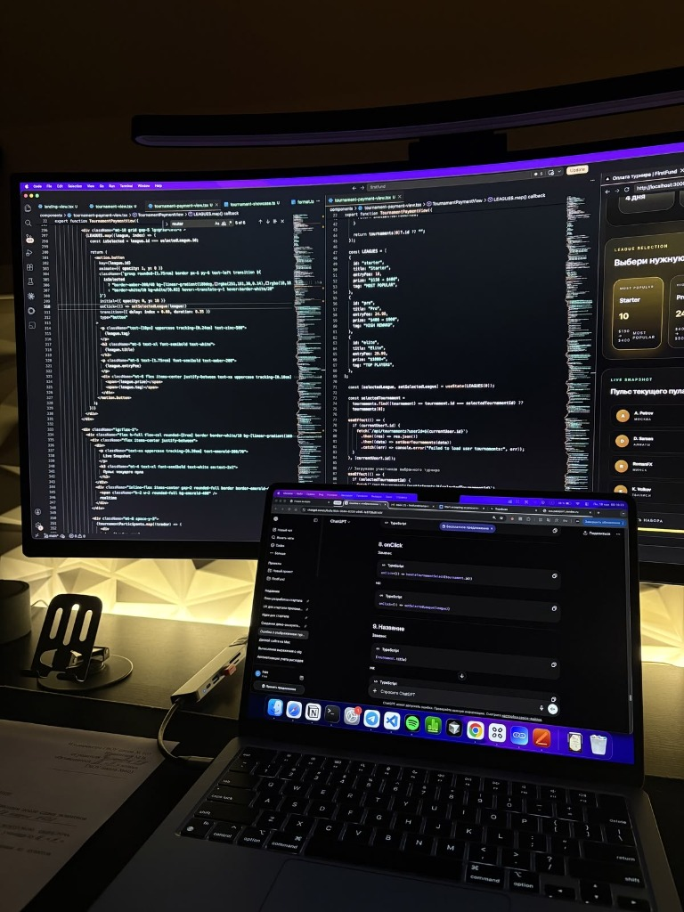
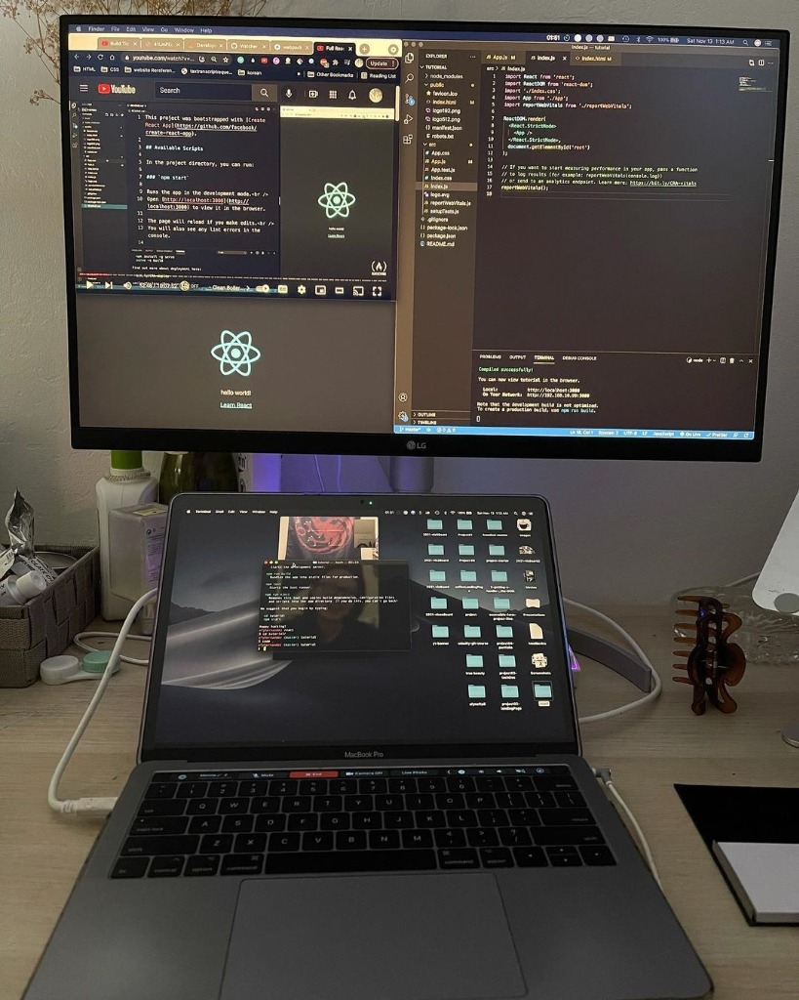

<div align="center">

<a href="https://github.com/MERCIA-lab">
  
</a>

<br/><br/>

<!-- ═══════════════════════════════════════════════════════════ -->
<!--            1. HERO IDENTITY & DYNAMIC HEADLINE              -->
<!-- ═══════════════════════════════════════════════════════════ -->

<a href="https://github.com/MERCIA-lab">
  
</a>

<br/>

<a href="https://github.com/MERCIA-lab">
  
</a>

<h1 align="center">Meek Dieu Merci NUKURI</h1>

</div>

<br/>

<!-- ═══════════════════════════════════════════════════════════ -->
<!--                     2. ABOUT PROFILE                        -->
<!-- ═══════════════════════════════════════════════════════════ -->

<h2>About</h2>

<p align="left">
  <a href="https://github.com/MERCIA-lab">
    
  </a>
</p>

<h4>Specialized in Distributed Systems, Cloud Infrastructure, and Applied Artificial Intelligence</h4>
<h4>Architecting high-throughput backend services, resilient microservices, and modern web applications.</h4>
<h4>Pursuing Computer Science with deep academic grounding in algorithms, data structures, and system design.</h4>
<h4>Hands-on expertise across full-stack TypeScript, Python, NestJS, Next.js, FastAPI, and PostgreSQL.</h4>
<h4>Active technical focus on Deep Learning architectures, LLM orchestration workflows, and MLOps pipelines.</h4>
<h4>Engineering philosophy centered on absolute reliability, modular system boundaries, and operational clarity.</h4>
<h4>Committed to open-source software craftsmanship and continuous technical innovation.</h4>

<br/>

<div align="left">
  <strong>Connect:</strong> &nbsp;
  <a href="https://github.com/MERCIA-lab" target="_blank">
    
  </a>
  &nbsp;
  <a href="mailto:meek@beullashop.com">
    
  </a>
  &nbsp;
  <a href="https://twitter.com/MERCIA_lab" target="_blank">
    
  </a>
  &nbsp;
  <a href="https://github.com/MERCIA-lab" target="_blank">
    
  </a>
</div>

<br/>

<!-- ═══════════════════════════════════════════════════════════ -->
<!--           3. CORE TECHNICAL COMPETENCIES                    -->
<!-- ═══════════════════════════════════════════════════════════ -->

<h2 align="center">Technical Competencies</h2>

<div align="center">
  <a href="https://skillicons.dev">
    
  </a>
  <br/>
  <a href="https://skillicons.dev">
    
  </a>
</div>

<br/>

<!-- ═══════════════════════════════════════════════════════════ -->
<!--            4. TELEMETRY & PERFORMANCE ANALYTICS             -->
<!-- ═══════════════════════════════════════════════════════════ -->

<h2 align="center">Performance Telemetry</h2>

<table width="100%" border="0" align="center">
  <tr align="center">
    <td width="50%" align="center" style="border: none;">
      <a href="https://github.com/MERCIA-lab">
        
      </a>
    </td>
    <td width="50%" align="center" style="border: none;">
      <a href="https://github.com/MERCIA-lab">
        
      </a>
    </td>
  </tr>
</table>

<br/>

<div align="center">
  <a href="https://github.com/MERCIA-lab">
    
  </a>
</div>

<br/>

<!-- ═══════════════════════════════════════════════════════════ -->
<!--            5. TECHNOLOGY STACK & INFRASTRUCTURE             -->
<!-- ═══════════════════════════════════════════════════════════ -->

<h2 align="center">Technology Stack &amp; Infrastructure</h2>

<div align="center">

<!-- Row 1: Languages & Core -->
<p align="center">
  
  
  
  
  
  
  
  
</p>

<!-- Row 2: Frameworks & Runtimes -->
<p align="center">
  
  
  
  
  
  
  
</p>

<!-- Row 3: Styling & Design Systems -->
<p align="center">
  
  
  
  
</p>

<!-- Row 4: Databases, Storage & ORMs -->
<p align="center">
  
  
  
  
  
</p>

<!-- Row 5: Cloud, Infrastructure, Tooling & AI -->
<p align="center">
  
  
  
  
  
  
  
</p>

</div>

<br/>

<!-- ═══════════════════════════════════════════════════════════ -->
<!--      6. REPOSITORY TELEMETRY & COMPUTING PHILOSOPHY         -->
<!-- ═══════════════════════════════════════════════════════════ -->

<table width="100%" border="0" align="center">
  <tr>
    <td width="50%" align="center" valign="top" style="border: none;">
      <h3>Repository Contributions</h3>
      <a href="https://github.com/MERCIA-lab/Shipping-Tracking-System">
        
      </a>
    </td>
    <td width="50%" align="center" valign="top" style="border: none;">
      <h3>Computing Philosophy</h3>
      
    </td>
  </tr>
</table>

<br/>

<!-- ═══════════════════════════════════════════════════════════ -->
<!--            7. WORKSTATION & ENGINEERING SETUP               -->
<!-- ═══════════════════════════════════════════════════════════ -->

<div align="center">

<table width="100%" border="0" cellspacing="0" cellpadding="0">
  <tr align="center">
    <td width="50%" align="center" valign="middle" style="border: none; padding: 2px;">
      <a href="https://github.com/MERCIA-lab">
        
      </a>
    </td>
    <td width="50%" align="center" valign="middle" style="border: none; padding: 2px;">
      <a href="https://github.com/MERCIA-lab">
        
      </a>
    </td>
  </tr>
</table>

</div>

<br/>

<!-- ═══════════════════════════════════════════════════════════ -->
<!--        8. FEATURED PROJECTS & REPOSITORIES PORTFOLIO        -->
<!-- ═══════════════════════════════════════════════════════════ -->

<h2 align="center">Featured Projects &amp; Architecture Portfolio</h2>

<div align="center">
  <a href="https://github.com/MERCIA-lab/Shipping-Tracking-System">
    
  </a>
</div>

<br/>

<table width="100%" border="0">

  <!-- Repository 1: Shipping-Tracking-System -->
  <tr>
    <td width="100%" style="border-bottom: 1px solid #333333; padding: 16px 0;">
      <h3>
        <a href="https://github.com/MERCIA-lab/Shipping-Tracking-System">Shipping-Tracking-System</a>
        &nbsp;
        
        &nbsp;
        
      </h3>
      <p>
        
      </p>
      <p>
        <strong>Architecture:</strong> Cloud-native logistics management suite handling end-to-end parcel dispatch, fleet telematics, dynamic warehouse allocation queues, and automated customer billing workflows.
      </p>
      <p>
        <strong>Tech Stack:</strong>
        <code>TypeScript</code> &bull; <code>NestJS</code> &bull; <code>Next.js</code> &bull; <code>PostgreSQL</code> &bull; <code>Prisma ORM</code> &bull; <code>Redis</code> &bull; <code>Docker</code> &bull; <code>Socket.IO</code>
      </p>
    </td>
  </tr>

  <!-- Repository 2: FreeMCue -->
  <tr>
    <td width="100%" style="border-bottom: 1px solid #333333; padding: 16px 0;">
      <h3>
        <a href="https://github.com/MERCIA-lab/FreeMCue">FreeMCue</a>
        &nbsp;
        
        &nbsp;
        
      </h3>
      <p>
        
      </p>
      <p>
        <strong>Architecture:</strong> High-performance macOS desktop assistant and intelligent teleprompter. Delivers context-sensitive meeting cues in real time while using OS-level window flags to remain entirely invisible on screen recordings and video conference streams.
      </p>
      <p>
        <strong>Tech Stack:</strong>
        <code>Python</code> &bull; <code>PyTorch</code> &bull; <code>macOS AppKit</code> &bull; <code>Speech Recognition</code> &bull; <code>Local LLM Inference</code>
      </p>
    </td>
  </tr>

  <!-- Repository 3: Financial-Advisor-System -->
  <tr>
    <td width="100%" style="border-bottom: 1px solid #333333; padding: 16px 0;">
      <h3>
        <a href="https://github.com/MERCIA-lab/Financial-Advisor-System">Financial-Advisor-System</a>
        &nbsp;
        
        &nbsp;
        
      </h3>
      <p>
        
      </p>
      <p>
        <strong>Architecture:</strong> Algorithmic wealth evaluation and financial advisory platform. Integrates automated risk profiling, spending pattern anomaly detection, and predictive asset allocation simulations.
      </p>
      <p>
        <strong>Tech Stack:</strong>
        <code>JavaScript</code> &bull; <code>Node.js</code> &bull; <code>Express</code> &bull; <code>PostgreSQL</code> &bull; <code>Predictive Analytics</code>
      </p>
    </td>
  </tr>

  <!-- Repository 4: daily-routine-tracker -->
  <tr>
    <td width="100%" style="border-bottom: 1px solid #333333; padding: 16px 0;">
      <h3>
        <a href="https://github.com/MERCIA-lab/daily-routine-tracker">daily-routine-tracker</a>
        &nbsp;
        
        &nbsp;
        
      </h3>
      <p>
        
      </p>
      <p>
        <strong>Architecture:</strong> High-efficiency execution cadence system engineered to track daily consistency, optimize focused work intervals, and analyze habit momentum with lightweight client synchronization.
      </p>
      <p>
        <strong>Tech Stack:</strong>
        <code>JavaScript</code> &bull; <code>CSS3</code> &bull; <code>Full-Stack</code> &bull; <code>Workflow Automation</code>
      </p>
    </td>
  </tr>

  <!-- Repository 5: iMeek Full Online Business System -->
  <tr>
    <td width="100%" style="border-bottom: 1px solid #333333; padding: 16px 0;">
      <h3>
        <a href="https://github.com/MERCIA-lab/iMeek-Full-Online-Business-System">iMeek-Full-Online-Business-System</a>
        &nbsp;
        
        &nbsp;
        
      </h3>
      <p>
        
      </p>
      <p>
        <strong>Architecture:</strong> Comprehensive digital commerce management system combining e-commerce storefront, inventory management, order processing pipelines, and real-time operational dashboards.
      </p>
      <p>
        <strong>Tech Stack:</strong>
        <code>TypeScript</code> &bull; <code>Next.js</code> &bull; <code>NestJS</code> &bull; <code>PostgreSQL</code> &bull; <code>Prisma ORM</code>
      </p>
    </td>
  </tr>

  <!-- Repository 6: MERCIA-lab Architecture -->
  <tr>
    <td width="100%" style="padding: 16px 0;">
      <h3>
        <a href="https://github.com/MERCIA-lab/MERCIA-lab">MERCIA-lab</a>
        &nbsp;
        
        &nbsp;
        
      </h3>
      <p>
        
      </p>
      <p>
        <strong>Architecture:</strong> Self-hosted profile analytics engine querying the GitHub GraphQL and REST APIs. Synthesizes monochrome SVG telemetry cards with zero external third-party dependencies, automated via GitHub Actions scheduled cron jobs.
      </p>
      <p>
        <strong>Tech Stack:</strong>
        <code>Python</code> &bull; <code>GitHub Actions</code> &bull; <code>GraphQL</code> &bull; <code>SVG Vector Graphics</code> &bull; <code>CI/CD Pipelines</code>
      </p>
    </td>
  </tr>

</table>

<br/>

<!-- ═══════════════════════════════════════════════════════════ -->
<!--                     9. SPONSORSHIP                          -->
<!-- ═══════════════════════════════════════════════════════════ -->

<div align="center">

<h2>Sponsorship &amp; Support</h2>

<a href="https://buymeacoffee.com/MERCIA_lab" target="_blank">
  
</a>

</div>

<br/><br/>

<!-- ═══════════════════════════════════════════════════════════ -->
<!--      10. DEEP DIVE: ARCHITECTURE & TECHNICAL DATA           -->
<!-- ═══════════════════════════════════════════════════════════ -->

<details>
<summary><strong>Architecture Specification: iMeek Cargo Express (Enterprise Logistics Platform)</strong></summary>
<br/>

> **Modern Logistics &amp; Cargo Management Platform** engineered for enterprise transportation pipelines, real-time shipment monitoring, and automated warehouse coordination.

| Capability | Architecture Overview |
|---|---|
| **Real-Time Tracking** | Live shipment geolocation updates with deterministic status lifecycle triggers |
| **Fleet Operations** | Real-time vehicle telematics, maintenance scheduling, and automated route dispatch |
| **Warehouse Operations** | Dynamic bay allocation, inventory state management, and dispatch queue balancing |
| **Customer Portal** | Self-service tracking console, historical documentation, and automated invoices |
| **Operational Analytics** | Live KPI monitoring, transit throughput metrics, and volume capacity telemetry |
| **Billing Pipelines** | Automated invoicing, multi-gateway transaction settlement, and audit logs |
| **Security &amp; RBAC** | Granular access control policies governing Admins, Dispatchers, Drivers, and Clients |
| **Event Bus** | Full-duplex WebSocket event distribution via Socket.IO and Redis pub/sub |

**Technology Stack:**
`Next.js` &bull; `React` &bull; `TypeScript` &bull; `Tailwind CSS` &bull; `NestJS` &bull; `PostgreSQL` &bull; `Prisma ORM` &bull; `Redis` &bull; `Docker` &bull; `Socket.IO`

</details>

<details>
<summary><strong>Engineering Focus, Trajectory &amp; 2026 Objectives</strong></summary>
<br/>

```text
Backend Engineering         ██████████████████░░  90%
Artificial Intelligence     ████████████████░░░░  80%
Frontend Development        ███████████████░░░░░  75%
System Design               ████████████░░░░░░░░  60%
Cloud Computing (AWS)       ███████████░░░░░░░░░  55%
DevOps / MLOps              ██████████░░░░░░░░░░  50%
```

```text
[====================>    ] STATUS: ACTIVE

Learning  ............ Deep Learning Architectures & LLMs
Building  ............ Production-Grade Intelligent Systems
Reading   ............ Distributed Systems & High-Throughput Design
Exploring ............ Cloud Infrastructure & Container Orchestration
Contributing ......... Open Source Systems & Frameworks
```

<table width="100%">
  <tr>
    <td width="50%" valign="top">

### Learning Roadmap
- **AI / Deep Learning**: Neural network foundations, transformers, and diffusion architectures
- **Generative Systems**: Agentic LLM systems, deterministic tool use, and RAG pipelines
- **MLOps**: Continuous model tracking, automated training pipelines, and edge deployment
- **Cloud Architecture**: AWS distributed serverless, container clustering, and event brokers
- **Orchestration**: Kubernetes cluster configuration, ingress controllers, and service meshes
- **Systems Engineering**: Fault-tolerant distributed consensus and low-latency message queues

    </td>
    <td width="50%" valign="top">

### 2026 Objectives
- **In Progress**: Deploy production-grade intelligent platforms
- **In Progress**: Master advanced deep learning architectures and LLM reasoning models
- **Planned**: Author and publish high-density systems engineering analyses
- **Planned**: Sustained contributions to core open-source repositories
- **Planned**: Complete AWS Solutions Architect certification
- **Planned**: Architect high-throughput distributed microservice backends

    </td>
  </tr>
</table>

#### Core Engineering Principles
> *"Great software is not just code — it is a careful balance of reliability, clarity, and human purpose."*

- **Reliability** &mdash; Deterministic execution under all network and load conditions.
- **Scalability** &mdash; Architectures engineered to handle growing throughput without structural redesign.
- **Security** &mdash; Data integrity and defensive posture integrated at every layer of the stack.
- **Maintainability** &mdash; Clean, modular, and self-documenting code built for long-term viability.
- **User Alignment** &mdash; Pragmatic engineering decisions guided by the end user's operational reality.

</details>

---

<!-- ═══════════════════════════════════════════════════════════ -->
<!--     11. AFRICA ANIMATION — KIGALI, RWANDA MARKER           -->
<!-- ═══════════════════════════════════════════════════════════ -->

<div align="center">

<br/>

<h3>▸ Origin Signal</h3>



<br/>

</div>

---

<div align="center">
  <sub>Engineering intelligent software through disciplined systems design, continuous learning, and scalable architecture.</sub>
</div>
