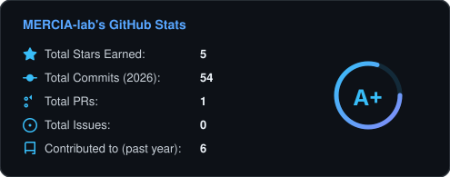
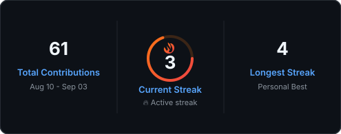
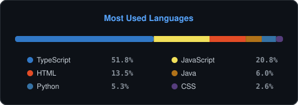
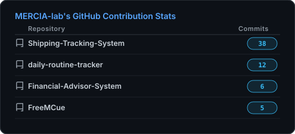
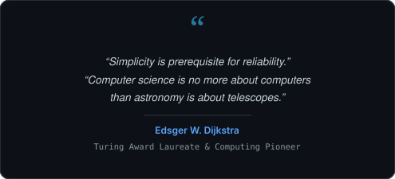
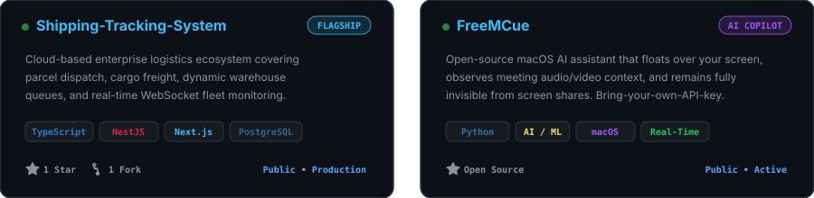

<div align="center">

<!-- ═══════════════════════════════════════════════════════════ -->
<!--                  1. MASTERHEAD BANNER                       -->
<!-- ═══════════════════════════════════════════════════════════ -->

<a href="https://github.com/MERCIA-lab">
  
</a>

<br/><br/>

<!-- ═══════════════════════════════════════════════════════════ -->
<!--            2. DYNAMIC TYPING HEADLINE & SALUTATION         -->
<!-- ═══════════════════════════════════════════════════════════ -->

<a href="https://github.com/MERCIA-lab">
  
</a>

<h1 align="center">Namaste 🙏 I'm Meek Dieu Merci NUKURI</h1>

</div>

<br/>

<!-- ═══════════════════════════════════════════════════════════ -->
<!--                     3. ABOUT ME                             -->
<!-- ═══════════════════════════════════════════════════════════ -->

<h2>💫 About Me</h2>

<p align="left">
  <a href="https://github.com/MERCIA-lab">
    
  </a>
</p>

<table width="100%" border="0">
  <tr>
    <td width="60%" valign="top" style="border: none;">

<h4>🌟 Began the journey with Computer Science and Software Engineering</h4>
<h4>👨‍💻 I work on Full-Stack development and Cloud Systems while focusing on Artificial Intelligence and Machine Learning.</h4>
<h4>🎓 I am currently pursuing a degree in Computer Science.</h4>
<h4>🛠️ Hands-on experience in Full-Stack, Scalable Backend Architectures, and Distributed Systems.</h4>
<h4>💬 Ask me about Python, TypeScript, NestJS, Next.js, FastAPI, Deep Learning, and System Design.</h4>
<h4>⚡ Passionate about Artificial Intelligence, Machine Learning, Deep Learning, Data Science, and Cloud Automation.</h4>
<h4>🤹 I only like perfection — building intelligent software through thoughtful engineering and practical innovation.</h4>

<br/>

<div align="right">
  <h3>🌟 Follow Me on:</h3>
  <a href="https://github.com/MERCIA-lab" target="_blank">
    
  </a>
  &nbsp;
  <a href="mailto:meek@beullashop.com">
    
  </a>
  &nbsp;
  <a href="https://twitter.com/MERCIA_lab" target="_blank">
    
  </a>
  &nbsp;
  <a href="https://github.com/MERCIA-lab" target="_blank">
    
  </a>
</div>

    </td>
    <td width="40%" align="center" valign="middle" style="border: none;">
      
    </td>
  </tr>
</table>

<br/>

<!-- ═══════════════════════════════════════════════════════════ -->
<!--      4. LANGUAGES & TOOLS I HAVE PLACED MY HANDS ON        -->
<!-- ═══════════════════════════════════════════════════════════ -->

<h2 align="center">💻 Languages & tools I Have placed My Hands On</h2>

<div align="center">
  <a href="https://skillicons.dev">
    
  </a>
  <br/>
  <a href="https://skillicons.dev">
    
  </a>
</div>

<br/>

<!-- ═══════════════════════════════════════════════════════════ -->
<!--                    5. GITHUB STATS                          -->
<!-- ═══════════════════════════════════════════════════════════ -->

<h2 align="center">⚡ GitHub Stats</h2>

<table width="100%" border="0" align="center">
  <tr align="center">
    <td width="50%" align="center" style="border: none;">
      <a href="https://github.com/MERCIA-lab">
        
      </a>
    </td>
    <td width="50%" align="center" style="border: none;">
      <a href="https://github.com/MERCIA-lab">
        
      </a>
    </td>
  </tr>
</table>

<br/>

<div align="center">
  <a href="https://github.com/MERCIA-lab">
    
  </a>
</div>

<br/>

<!-- ═══════════════════════════════════════════════════════════ -->
<!--                     6. TECH STACK                           -->
<!-- ═══════════════════════════════════════════════════════════ -->

<h2 align="center">💻 Tech Stack</h2>

<div align="center">

<!-- Row 1: Languages & Shell -->
<p align="center">
  
  
  
  
  
  
  
  
  
</p>

<!-- Row 2: Frameworks & Web -->
<p align="center">
  
  
  
  
  
  
  
  
  
</p>

<!-- Row 3: AI/ML, Databases & Cloud -->
<p align="center">
  
  
  
  
  
  
  
  
  
</p>

<!-- Row 4: Tools & Platforms -->
<p align="center">
  
  
  
  
  
  
  
  
</p>

</div>

<br/>

<!-- ═══════════════════════════════════════════════════════════ -->
<!--      7. TOP-CONTRIBUTED REPO & RANDOM DEV QUOTE             -->
<!-- ═══════════════════════════════════════════════════════════ -->

<table width="100%" border="0" align="center">
  <tr>
    <td width="50%" align="center" valign="top" style="border: none;">
      <h3>⭐ Top-Contributed Repo</h3>
      <a href="https://github.com/MERCIA-lab/Shipping-Tracking-System">
        
      </a>
    </td>
    <td width="50%" align="center" valign="top" style="border: none;">
      <h3>💭 Random Dev Quote</h3>
      
    </td>
  </tr>
</table>

<br/>

<!-- ═══════════════════════════════════════════════════════════ -->
<!--             8. FEATURED PROJECT SHOWCASE                    -->
<!-- ═══════════════════════════════════════════════════════════ -->

<h2 align="center">🚀 Featured Project Showcase</h2>

<div align="center">
  <a href="https://github.com/MERCIA-lab/Shipping-Tracking-System">
    
  </a>
</div>

<br/>

<!-- ═══════════════════════════════════════════════════════════ -->
<!--                     9. SUPPORT ME                           -->
<!-- ═══════════════════════════════════════════════════════════ -->

<div align="center">

<h2>Support Me ☕</h2>

<a href="https://buymeacoffee.com/MERCIA_lab" target="_blank">
  
</a>

<br/><br/>

<!-- ═══════════════════════════════════════════════════════════ -->
<!--                    10. FOOTER BANNER                        -->
<!-- ═══════════════════════════════════════════════════════════ -->


</div>

<br/>

<!-- ═══════════════════════════════════════════════════════════ -->
<!--      11. DEEP DIVE: FEATURED PROJECT & TECHNICAL DATA       -->
<!-- ═══════════════════════════════════════════════════════════ -->

<details>
<summary><strong>🚀 Featured Project Deep Dive: iMeek Cargo Express (Enterprise Logistics Platform)</strong></summary>
<br/>

> **Modern Logistics & Cargo Management Platform** designed for enterprise-scale transportation, real-time shipment monitoring, and automated warehouse operations.

| Capability | Architecture Overview |
|---|---|
| 📍 **Real-Time Tracking** | Live shipment geolocation updates with status lifecycle triggers |
| 🚛 **Fleet Operations** | Fleet tracking, maintenance schedules, and automated vehicle dispatch |
| 🏭 **Warehouse Management** | Dynamic storage allocation, inventory control, and load queues |
| 👥 **Customer Portal** | Self-service tracking, client history, documentation, and invoices |
| 📊 **Live Analytics** | Operational KPIs, throughput metrics, and volume charts |
| 💳 **Payments & Billing** | Integrated billing pipelines, transaction verification, and receipt generation |
| 🔐 **RBAC Security** | Granular permissions across Admins, Dispatchers, Drivers, and Clients |
| ⚡ **Live Synchronization** | Real-time WebSocket event bus via Socket.IO |

**Technology Stack:**
`Next.js` • `React` • `TypeScript` • `Tailwind CSS` • `NestJS` • `PostgreSQL` • `Prisma ORM` • `Redis` • `Docker` • `Socket.IO`

</details>

<details>
<summary><strong>💼 Development Journey, Status & 2026 Objectives</strong></summary>
<br/>

```text
Backend Engineering         ██████████████████░░  90%
Artificial Intelligence     ████████████████░░░░  80%
Frontend Development        ███████████████░░░░░  75%
System Design               ████████████░░░░░░░░  60%
Cloud Computing (AWS)       ███████████░░░░░░░░░  55%
DevOps / MLOps              ██████████░░░░░░░░░░  50%
```

```text
[====================>    ] STATUS: ACTIVE

Learning  ............ Deep Learning & LLMs
Building  ............ Production AI Applications
Reading   ............ Distributed Systems & Architecture
Exploring ............ Cloud Infrastructure & Kubernetes
Contributing ......... Open Source Communities
```

<table width="100%">
  <tr>
    <td width="50%" valign="top">

### 📚 Learning Roadmap
- **AI / Deep Learning**: Neural architectures & transformer models
- **Generative AI**: LLM agents, RAG pipelines, function calling
- **MLOps**: Automated model tracking & continuous training
- **Cloud Architecture**: AWS distributed serverless & containers
- **Orchestration**: Kubernetes clusters, service meshes
- **Systems Engineering**: Fault-tolerant event-driven pipelines

    </td>
    <td width="50%" valign="top">

### 🚀 2026 Objectives
- 🔄 **In Progress**: Build production-ready AI systems
- 🔄 **In Progress**: Master Deep Learning & LLM architectures
- 📋 **Planned**: Publish deep-dive technical engineering articles
- 📋 **Planned**: Regular, high-impact Open Source contributions
- 📋 **Planned**: Advance AWS Cloud Architect certification
- 📋 **Planned**: Deploy enterprise distributed platforms

    </td>
  </tr>
</table>

#### 🧠 Engineering Philosophy
> *"Great software is not just code — it is a careful balance of reliability, clarity, and human purpose."*

- **Reliable** — does what it promises, every single execution.
- **Scalable** — engineered to grow gracefully with increasing throughput.
- **Secure** — data integrity and defensive security are paramount.
- **Maintainable** — clean, self-documenting code built for longevity.
- **User Focused** — the end user's operational reality guides technical decisions.

</details>

---

<div align="center">
  <sub>⭐ If you find my work inspiring, consider giving this repository a star!</sub>
</div>
